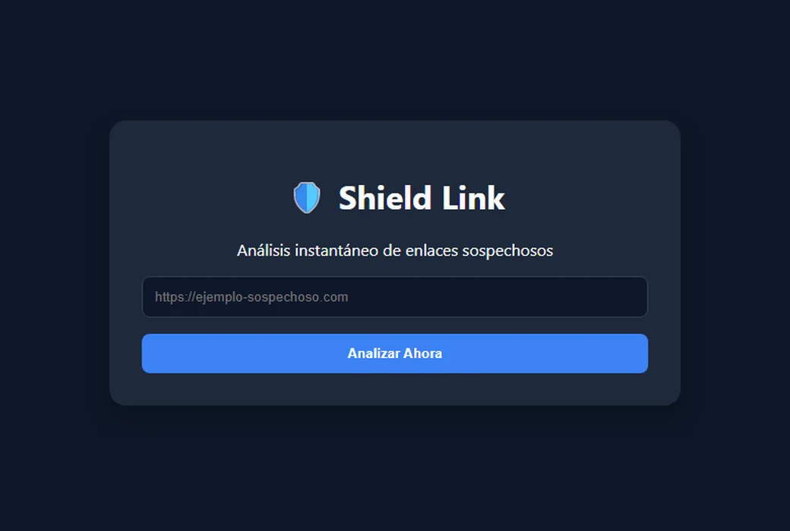

[English](README.md) | **Español**

# Shield Link

Un escáner de seguridad de enlaces. Pegas un enlace y obtienes un veredicto antes de
abrirlo.

**En vivo en [shield-link.vercel.app](https://shield-link.vercel.app)**



Proyecto de ciberseguridad para Ingeniería en Informática, Universidad Alejandro de
Humboldt.

## Cómo se llega a un veredicto

Seis capas, de la más barata a la más cara. Cualquiera puede resolver por su cuenta, así
que la mayoría de los enlaces nunca llega a la API del final.

| # | Capa | Qué decide |
| - | ---- | ---------- |
| 1 | Validación de formato | Rechaza lo que no sea una URL `http(s)`, antes de gastar nada |
| 2 | Heurística de TLD | Bloquea `.xyz`, `.zip`, `.mov`, `.tk`, `.fit`, `.icu`, `.top` de entrada — concentran phishing y malware muy por encima de su peso en la web |
| 3 | Lista blanca local | Una URL ya verificada se responde desde Postgres, sin volver a analizarla |
| 4 | Lista negra local | Igual para una ya encontrada maliciosa, con el motivo original |
| 5 | VirusTotal API v3 | ~90 motores, consultados solo para lo que las cuatro capas anteriores no resolvieron |
| 6 | Heurística de protocolo | Último recurso: `http` sin cifrar y sin datos de reputación se señala como inseguro |

Todo veredicto firme de la capa 5 se escribe de vuelta en la 3 o la 4, así que la segunda
consulta de la misma URL no cuesta nada. En producción eso es la diferencia entre
responder en 790 ms y hacerlo en 350 ms, y reserva el presupuesto de 500 consultas
diarias del plan gratuito para los enlaces que sí lo necesitan.

Ese presupuesto —4 consultas por minuto, 500 por día— lo comparten todos los visitantes,
así que las consultas que llegarían a la capa 5 tienen además un límite por cliente: 4 por
minuto y 50 por día. Pasado el límite, `/api/scan` responde `429`. Los veredictos de caché
y de heurística no cuestan nada y nunca cuentan, así que siguen respondiendo.

## Tres veredictos, no dos

VirusTotal agrega unos noventa motores de calidad muy despareja, y un puñado de
detecciones sobre un dominio establecido suele ser ruido. `google.com` reporta dos motores
que lo marcan como malicioso contra sesenta y uno que lo dan por limpio. Tratar "uno o más
motores" como peligroso —que es lo que este proyecto hacía al principio— clasifica media
web como amenaza y enseña al usuario a ignorar el aviso.

Por eso el escáner reporta tres niveles y muestra la cuenta:

```jsonc
// https://github.com — nada encontrado
{ "nivel": "seguro", "motivo": "Análisis global completado: ninguno de los 90 motores de seguridad detectó amenazas." }

// https://google.com — una minoría de motores discrepa, y al usuario se le dice exactamente eso
{ "nivel": "precaucion", "motivo": "Detecciones minoritarias: 2 de 90 motores marcan este enlace. Esa proporción suele ser un falso positivo, pero conviene revisarlo antes de abrirlo." }

// https://algo.xyz — bloqueado antes de gastar una consulta
{ "nivel": "peligroso", "motivo": "Bloqueo preventivo: la extensión .xyz se utiliza frecuentemente para campañas de phishing y distribución de malware." }
```

Un veredicto de `precaucion` a propósito nunca se cachea: es un juicio sobre evidencia
ambigua, y guardarlo en cualquiera de las dos listas convertiría un quizás en un sí o un
no.

## Stack

| Capa | Elección | Por qué |
| ---- | -------- | ------- |
| Framework | [Astro](https://astro.build) 6, SSR en [Vercel](https://vercel.com) | La página es estática salvo por un endpoint; Astro no envía JavaScript para el resto |
| Base de datos | PostgreSQL en [Neon](https://neon.tech) | Dos tablas de reputación y un contador de consultas por cliente, accesibles solo desde el servidor. El driver serverless de Neon habla por HTTP, lo que encaja con una función de Vercel que vive una sola petición — un pool ahí abre una conexión por invocación |
| Inteligencia de amenazas | [VirusTotal API v3](https://www.virustotal.com) | Plan gratuito, llamado desde el servidor para que la clave nunca llegue al navegador |
| Gestor de paquetes | [pnpm](https://pnpm.io) | |

## Seguridad

Las tablas de reputación deciden si a un usuario se le dice que un enlace es seguro, lo
que convierte el acceso de escritura en lo más sensible del proyecto. Una versión
temprana traía esto:

```sql
CREATE POLICY "..." ON lista_blanca FOR ALL USING (true);
```

`FOR ALL` cubre select, insert, update y delete, y `USING (true)` se lo concede a
cualquiera — incluida la clave anónima, que es pública por diseño y se lee en las
herramientas de desarrollo de cualquier navegador. Cualquiera podía insertar una URL
maliciosa en la lista blanca y hacer que Shield Link la diera por buena, o vaciar ambas
tablas.

Una política más estrecha no lo habría arreglado: el escáner necesita escribir para
cachear veredictos, así que cualquier política que permita escribir desde el navegador es
una que un atacante puede usar. En su lugar, toda la cascada se movió al servidor. Hoy:

- La base se movió de Supabase a Neon, así que ya no hay PostgREST ni clave anónima
  delante. Solo se llega con la cadena de conexión.
- Solo `/api/scan` y `/api/health` la tocan, y ambos corren en el servidor.
- El bundle del navegador no contiene cliente de base de datos ni credencial — comprobable
  con `grep -r neon dist/client` después de un build.

## Ejecutarlo en local

```sh
pnpm install
cp .env.example .env    # completa los dos valores de abajo
pnpm dev                # http://localhost:4321
```

Ejecuta `schema.sql` contra esa base. Es idempotente: crea las tablas si no existen y deja
intactas las filas que ya estén.

| Variable | Dónde obtenerla |
| -------- | --------------- |
| `DATABASE_URL` | Cualquier cadena de conexión de PostgreSQL. El proyecto usa SQL plano, no un SDK |
| `VIRUSTOTAL_API_KEY` | virustotal.com → tu perfil → API key |

Ninguna lleva prefijo `PUBLIC_` a propósito: Astro expone las `PUBLIC_*` a los bundles del
cliente, y la cadena de conexión da acceso completo a la base.

## Verificar la configuración

```sh
curl https://shield-link.vercel.app/api/health
```

```json
{
  "base": {
    "urlDefinida": true,
    "alcanzable": true,
    "error": null
  },
  "virustotal": { "clave": true },
  "node": "v24.20.0",
  "cacheActivo": true
}
```

Una cadena de conexión ausente y una equivocada se ven idénticas desde fuera: el escáner
sigue respondiendo, solo que sin caché, gastando cuota de VirusTotal en cada consulta
hasta agotar el límite diario sin avisar. El endpoint devuelve booleanos, la versión de
Node y, si la base no responde, el mensaje de error del driver; no expone el valor, el
prefijo ni la longitud de ningún secreto.

---

Hecho por Bryan Belandria — [github.com/BryanBel](https://github.com/BryanBel)
