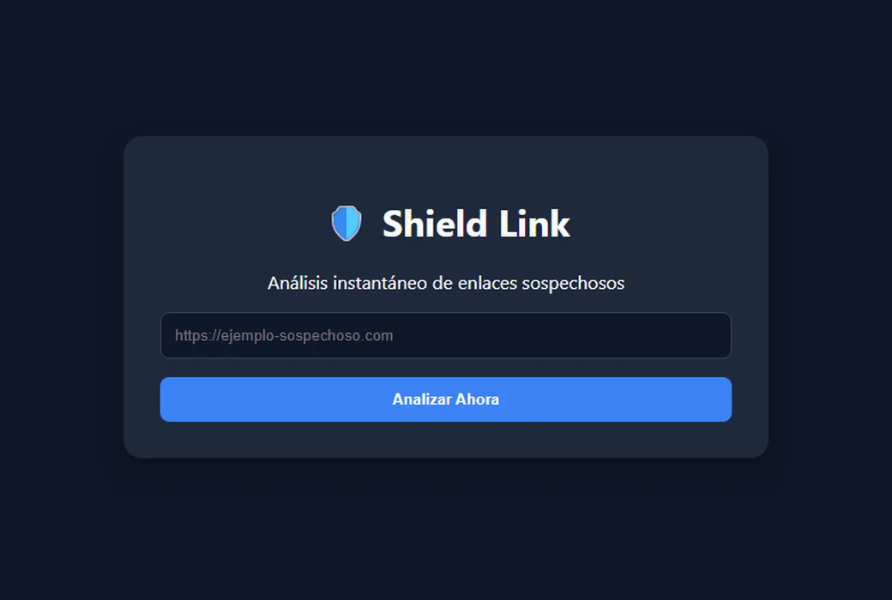

**English** | [Español](README.es.md)

# Shield Link

A URL safety scanner. Paste a link, get a verdict before you click it.

**Live at [shield-link.vercel.app](https://shield-link.vercel.app)**



Built as a cybersecurity project for the Computer Engineering programme at Universidad
Alejandro de Humboldt.

## How a verdict is reached

Six layers, cheapest first. Each one can answer on its own, so most links never reach the
paid API at the bottom.

| # | Layer | What it decides |
| - | ----- | --------------- |
| 1 | Format validation | Rejects anything that is not an `http(s)` URL, before any work happens |
| 2 | High-risk TLD heuristic | Blocks `.xyz`, `.zip`, `.mov`, `.tk`, `.fit`, `.icu`, `.top` outright — these carry phishing and malware far out of proportion to their share of the web |
| 3 | Local allowlist | A URL already cleared is answered from Postgres, not re-scanned |
| 4 | Local blocklist | A URL already found malicious is answered the same way, with the original reason |
| 5 | VirusTotal API v3 | ~90 engines, queried only for URLs the first four layers could not settle |
| 6 | Protocol heuristic | Last resort: plain `http` with no reputation data anywhere is called out as unencrypted |

Every confident verdict from layer 5 is written back into layer 3 or 4, so the second
lookup of the same URL costs nothing. In production that is the difference between a
790 ms answer and a 350 ms one, and it keeps the free tier's 500-requests-a-day budget
for links that actually need it.

## Three verdicts, not two

VirusTotal aggregates around ninety engines of very uneven quality, and a handful of
detections on an established domain is routinely noise. `google.com` itself reports two
engines calling it malicious against sixty-one calling it harmless. Treating "one or more
engines" as dangerous — which is what this project did at first — labels most of the web
a threat and teaches the user to ignore the warning.

So the scanner reports three levels and shows its arithmetic:

```jsonc
// https://github.com  — nothing found
{ "nivel": "seguro", "motivo": "Análisis global completado: ninguno de los 90 motores de seguridad detectó amenazas." }

// https://google.com — a minority of engines disagree, and the user is told exactly that
{ "nivel": "precaucion", "motivo": "Detecciones minoritarias: 2 de 90 motores marcan este enlace. Esa proporción suele ser un falso positivo, pero conviene revisarlo antes de abrirlo." }

// https://something.xyz — blocked before spending a request
{ "nivel": "peligroso", "motivo": "Bloqueo preventivo: la extensión .xyz se utiliza frecuentemente para campañas de phishing y distribución de malware." }
```

A `precaucion` verdict is deliberately never cached: it is a judgement call about
ambiguous evidence, and writing it into either list would harden a maybe into a yes or
a no.

## Stack

| Layer | Choice | Why |
| ----- | ------ | --- |
| Framework | [Astro](https://astro.build) 6, SSR on [Vercel](https://vercel.com) | The page is static except for one endpoint; Astro ships no JavaScript for the rest |
| Database | [Supabase](https://supabase.com) (Postgres) | Two reputation tables, reached only from the server |
| Threat intelligence | [VirusTotal API v3](https://www.virustotal.com) | Free tier, called from the server so the key never ships to a browser |
| Package manager | [pnpm](https://pnpm.io) | |

## Security

The reputation tables decide whether a user is told a link is safe, which makes write
access to them the most sensitive thing in the project. An early version shipped this:

```sql
CREATE POLICY "..." ON lista_blanca FOR ALL USING (true);
```

`FOR ALL` covers select, insert, update and delete, and `USING (true)` grants it to every
caller — including the anonymous key, which is public by design and readable in any
browser's devtools. Anyone could have inserted a malicious URL into the allowlist and had
Shield Link vouch for it, or emptied both tables.

A narrower policy would not have fixed it: the scanner has to write in order to cache
verdicts, so any policy permitting a browser write is one an attacker can use. The whole
cascade moved server-side instead. Today:

- `schema.sql` enables row-level security with **no policies at all**, which denies every
  anonymous and authenticated request by default, and revokes the table grants too.
- Only `/api/scan` touches the database, holding the secret key that bypasses RLS.
- The browser bundle contains no Supabase client and no key — verifiable with
  `grep -r supabase dist/client` after a build.

## Running it locally

```sh
pnpm install
cp .env.example .env    # fill in the three values below
pnpm dev                # http://localhost:4321
```

Run `schema.sql` in the Supabase SQL editor. It is idempotent: it creates the tables if
they are missing and re-applies the security policies without touching existing rows.

| Variable | Where to get it |
| -------- | --------------- |
| `SUPABASE_URL` | Supabase dashboard → Project Settings → API Keys |
| `SUPABASE_SECRET_KEY` | Same page — the **secret** key (`sb_secret_…`), not the publishable one |
| `VIRUSTOTAL_API_KEY` | virustotal.com → your profile → API key |

None of them carry a `PUBLIC_` prefix on purpose: Astro exposes `PUBLIC_*` to client
bundles, and the secret key bypasses row-level security.

## Checking the configuration

```sh
curl https://shield-link.vercel.app/api/health
```

```json
{
  "supabase": {
    "url": true,
    "clave": true,
    "nombreUsado": "SUPABASE_SECRET_KEY",
    "alcanzable": true,
    "error": null
  },
  "virustotal": { "clave": true },
  "node": "v24.19.0",
  "cacheActivo": true
}
```

A missing key and a wrong key otherwise look identical from outside — the scanner keeps
answering, just without its cache, quietly spending VirusTotal quota on every request
until the daily limit runs out. The endpoint returns booleans only; no value, prefix or
length of any secret is exposed.

---

Built by Bryan Belandria — [github.com/BryanBel](https://github.com/BryanBel)
