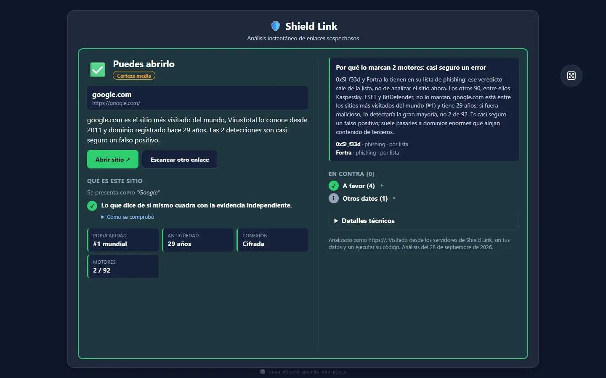
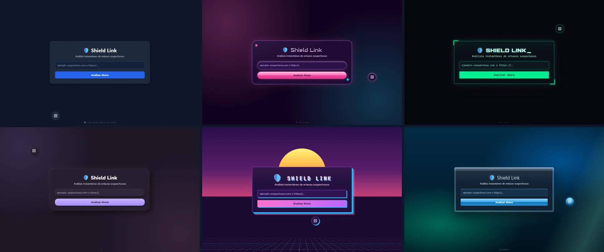

**English** | [Español](README.es.md)

# Shield Link

A URL safety scanner. Paste a link, get a verdict before you click it.

**Live at [shield-link.vercel.app](https://shield-link.vercel.app)**

https://github.com/user-attachments/assets/75a1b143-63ca-4819-af09-97137775a961

*28 seconds, built from a real report for `aka.ms/wsl`: the link breaks into its domain, certificate and
destination, each finding folds back into the verdict, and the name ends up running through all six designs.*

Built as a cybersecurity project for the Computer Engineering programme at Universidad
Alejandro de Humboldt.

## How a verdict is reached

A blocklist can only say whether someone has already reported a link. Shield Link
investigates it: four sources at once, every finding turned into a signal, and the verdict
decided from those signals — which the page then shows, so the answer comes with its
reasons.

| Source | What it contributes |
| ------ | ------------------- |
| [VirusTotal API v3](https://www.virustotal.com) | The opinion of ~90 engines: which flagged the link and as what, how the web categorises it, how long VirusTotal has known it |
| A visit to the link | Where it really goes, hop by hop; its TLS certificate; and what the page is — its title, whether it asks for a password, and where that password would be sent |
| [RDAP](https://about.rdap.org), from the registries | When the domain was registered and through whom; which network owns the server's IP |
| [Tranco](https://tranco-list.eu) | How popular the domain is among the million most visited sites — the scale detections are read against |
| The URL itself | Tricks in the address: a high-risk TLD, punycode look-alikes, an IP instead of a name, text before an `@`, a brand name on a domain the brand does not own |

When a link lands on a different domain — a shortener, a redirect — the destination is what
the user will actually see, so it gets its own reputation and registration check.

A bare domain works as well as a full URL: `google.com` is analysed as `https://google.com`,
the scheme browsers try first, and the report says it was assumed. Anything that is not a
web link — `javascript:`, `data:`, `mailto:`, an email address pasted by mistake — is
refused before any work happens.

Every signal is good news, neutral, a warning or a danger, and the verdict follows them:

- **Any danger → `peligroso`.** Three or more engines; a domain registered days ago; a
  password form that posts to another domain; a login page presenting itself as a bank on
  a domain the bank does not own; an official domain buried in a subdomain, as in
  `paypal.com.example.net`; a TLD like `.xyz`, `.zip` or `.top`, which carry phishing far
  out of proportion to their share of the web and are blocked without spending a
  VirusTotal lookup.
- **Otherwise, any warning → `precaucion`.** One or two engines; no HTTPS; a domain a few
  weeks old; an invalid certificate; a redirect to an unrelated domain nobody vouches for.
- **Otherwise → `seguro`.**

The answer is given the way the question is asked: *Puedes abrirlo*, *Ábrelo con cuidado*,
*No lo abras* — with a button to open the site. It asks for confirmation first: a plain one
for a safe link, one that repeats the main warning for caution, and for a dangerous link a
second step, ticking "I understand the risk", before anything opens.

### Making sense of a detection

VirusTotal aggregates around ninety engines of very uneven quality. Treating "one or more
engines" as dangerous, which is what this project did at first, labels most of the web a
threat and teaches the user to ignore the warning. So a detection is explained, using only
what can be checked:

- **How the engine decided.** VirusTotal reports each engine's method. `blacklist` means the
  URL is on that engine's list — the verdict comes from the list, not from analysing the
  site now.
- **Who disagrees.** "The other 90, Kaspersky, ESET and BitDefender among them, do not flag
  it" says more than a count.
- **Scale.** `google.com` is flagged by two blocklists as this is written. It is also the
  most visited site in the world and 29 years old: if it were malicious, most engines would
  say so, not two of 92. A domain in Tranco's top 10,000, at least five years old, flagged
  by one or two engines, is called safe — with the detections shown and explained as an
  almost certain false positive.
- **Except on open platforms.** `sites.google.com`, `*.github.io`, `*.vercel.app`, Google
  Docs forms and the like are popular because anyone can publish there, and phishing kits
  do. Their fame vouches for nothing, so detections there keep their weight.
- **What the engine is,** only when its own vendor documents it. Bfore.Ai PreCrime, for
  example, is predictive: it flags domains whose patterns could be used in attacks before
  any attack happens. A lone detection from it is reported as a prediction, not as an
  attack found.



### How sure it is

Each verdict carries a certainty. A safe link that VirusTotal has analysed and found
clean, on a domain more than a year old, with a valid certificate, is *high*. A safe link
VirusTotal has never seen is *low* — nobody has reported it, but nothing vouches for it
either — and the page says that in words rather than implying more than it knows. A verdict
that had to explain detections away is never more than *medium*.

```jsonc
// POST /api/scan { "url": "google.com" } — abridged
{
  "nivel": "seguro",
  "certeza": "media",
  "recomendacion": "Puedes abrirlo",
  "motivo": "google.com es el sitio más visitado del mundo, VirusTotal lo conoce desde 2011 y dominio registrado hace 29 años. Las 2 detecciones son casi seguro un falso positivo.",
  "detecciones": {
    "interpretacion": "falso-positivo",
    "texto": "0xSI_f33d y Fortra lo tienen en su lista de phishing: ese veredicto sale de la lista, no de analizar el sitio ahora. Los otros 90, entre ellos Kaspersky, ESET y BitDefender, no lo marcan. …"
  },
  "sitio": { "estado": "coherente", "conclusion": "Lo que dice de sí mismo cuadra con la evidencia independiente." },
  "senales": [{ "tipo": "bien", "titulo": "google.com es el sitio más visitado del mundo" }],
  "detalles": { "popularidad": {}, "destino": {}, "dominio": {}, "certificado": {}, "servidor": {}, "reputacion": {}, "pagina": {} }
}
```

### What the site says, and whether it holds up

The report quotes how the site describes itself — its meta description, or its title —
and then checks that claim against evidence the site does not control: whether a brand it
names itself after actually owns the domain, whether what it says it does matches how
security vendors classify it, and how long the domain has existed. The conclusion is one
of *holds up*, *doubtful*, *does not hold up* or *not enough evidence*, with the points
behind it.

These are fixed rules, not a language model. On a phishing page the description is the
attacker's own text, and a model reading it can be talked into repeating it; a rule
cannot. A page calling itself a brand it is not, or a vendor classifying the site as
phishing, also raises a warning in the verdict, so the conclusion and the verdict never
disagree.

### Visiting a link without being used by it

A server that fetches a URL someone else chose can be pointed at itself — `127.0.0.1`, the
cloud metadata address `169.254.169.254`, a private network. Every connection Shield Link
makes goes through its own DNS lookup, which refuses any address that is not public, IPv4
or IPv6. The check runs at the moment of connecting, so a hostname cannot resolve to a
public address when checked and a private one when used.

Beyond that: only ports 80, 443, 8080 and 8443; at most 8 redirects and 7 seconds; no more
than 512 KB of HTML, read as text and never executed; no cookies, and any credentials in
the URL are stripped before the request.

Some links are consumed by opening them — a password reset, an email confirmation, an
unsubscribe. When a link looks like one (a `token`, `code` or `reset` parameter, a long
random path segment), Shield Link only checks its server and certificate, without opening
the page, and says so.

The limit of any visit from a server: a site can show it something different from what it
shows a person. The other sources exist so the verdict never rests on the visit alone.

### Cache and budget

Reports are cached in Postgres, keyed by the SHA-256 of the URL — never the URL itself,
since a link can carry a token — and every URL inside a stored report has its query
removed. They expire: 7 days for a safe verdict, 1 for caution, 30 for dangerous, because a
verdict is a snapshot and domains change hands.

Because the sources run in parallel, a full investigation is quick. Measured in production
from a client whose bare round trip to the site is 80 ms: a fresh analysis took 417 ms and
a cached one 91 ms (medians of 4 and 12). The first request after five idle minutes also
wakes the database, which cost about 600 ms extra in an earlier, single measurement.

VirusTotal's free tier allows 4 lookups a minute and 500 a day, shared by every visitor, and
each fresh analysis also visits the site. So fresh analyses are limited per client: 4 a
minute and 50 a day. Past that, `/api/scan` answers `429`. Cached reports cost nothing and
are never counted.

## Designs

The page comes in six styles — Classic, Y2K, Cyberpunk, Clay, Vaporwave and Vista Aero. The round dice
button switches to a random one: the new style grows out of the button in a circle, and
the dice hops to a free spot somewhere else on the screen (on a phone it stays centred under
the card, where there is room for it). The chosen style is remembered
and applied before the first paint, so the page never flashes the default look. Every
style also has a light mode, but that — and a few other things — are for the curious to
find.



Every style is a set of values for the same variables, defined in
[`src/styles/estilos/_contrato.css`](src/styles/estilos/_contrato.css); the components only
read those variables. Adding a style is one CSS file in that folder and one line in
[`registro.js`](src/styles/estilos/registro.js) — nothing else changes. `pnpm test` checks
every registered style against the contract in both modes: that no variable is missing,
and that every pair of colours drawn as text reaches WCAG AA contrast (4.5:1). The
original design's button, white on `#3b82f6`, measured 3.68:1 and never did.

Fonts are self-hosted, so the Content-Security-Policy stays at `'self'`, and a browser only
downloads the ones the active style uses. Anyone who asks their system for reduced motion
gets no sparkles, blinking cursors or moving grids.

## Stack

| Layer | Choice | Why |
| ----- | ------ | --- |
| Framework | [Astro](https://astro.build) 7, SSR on [Vercel](https://vercel.com) | The page is prerendered and one endpoint does the work; the browser gets a single 22 KB script for the report and the styles |
| Database | PostgreSQL on [Neon](https://neon.tech) | An analysis cache and a per-client counter, reached only from the server. Neon's serverless driver talks over HTTP, which suits a Vercel function that lives for one request — a connection pool there opens a connection per invocation |
| Threat intelligence | [VirusTotal API v3](https://www.virustotal.com) | Free tier, called from the server so the key never ships to a browser |
| Package manager | [pnpm](https://pnpm.io) | |

## Security

The reputation tables decide whether a user is told a link is safe, which makes write
access to them the most sensitive thing in the project. An early version shipped this:

```sql
CREATE POLICY "..." ON lista_blanca FOR ALL USING (true);
```

`FOR ALL` covers select, insert, update and delete, and `USING (true)` grants it to every
caller — including the anonymous key, which is public by design and readable in any
browser's devtools. Anyone could have inserted a malicious URL into the allowlist and had
Shield Link vouch for it, or emptied both tables.

A narrower policy would not have fixed it: the scanner has to write in order to cache
verdicts, so any policy permitting a browser write is one an attacker can use. The whole
cascade moved server-side instead. Today:

- The database moved off Supabase to Neon, so there is no PostgREST and no anonymous key
  in front of it. It is reachable only with the connection string.
- Only `/api/scan` and `/api/health` touch it, and both run on the server.
- They connect as `shieldlink_app`, a role that can read and write rows in its tables and
  nothing else: no `DROP`, `ALTER`, `TRUNCATE`, `CREATE TABLE` or `CREATE ROLE`. A leaked
  connection string costs rows, not the database. The owner's string never leaves the
  developer's machine.
- The browser bundle contains no database client and no credential — verifiable with
  `grep -r neon dist/client` after a build.

The page itself runs under a Content-Security-Policy that Astro generates with a hash for
every inline script and style, and loads nothing from another origin. `vercel.json` adds
the headers a `<meta>` tag cannot carry: `frame-ancestors 'none'` and `X-Frame-Options`
against clickjacking, plus `nosniff`, a `Referrer-Policy` and a `Permissions-Policy`.

## Running it locally

```sh
pnpm install
cp .env.example .env    # fill in the values below
pnpm dev                # http://localhost:4321
pnpm test               # analysis logic, input rules and the style contract
```

Create the application role once, as the database owner, then apply `schema.sql` with
`psql`. The file is idempotent: it creates the tables if they are missing, leaves existing
rows alone, and grants the role its privileges.

```sh
psql "$DATABASE_URL_ADMIN" -c "CREATE ROLE shieldlink_app LOGIN PASSWORD '...'"
psql "$DATABASE_URL_ADMIN" -f schema.sql
```

| Variable | Where to get it |
| -------- | --------------- |
| `DATABASE_URL` | Connection string for `shieldlink_app`. Any PostgreSQL works; the project speaks plain SQL, not a vendor SDK |
| `DATABASE_URL_ADMIN` | The owner's connection string. Local only, for `schema.sql`; never set it on Vercel |
| `VIRUSTOTAL_API_KEY` | virustotal.com → your profile → API key |

None carries a `PUBLIC_` prefix on purpose: Astro exposes `PUBLIC_*` to client bundles.

## Checking the configuration

```sh
curl https://shield-link.vercel.app/api/health
```

```json
{
  "base": {
    "urlDefinida": true,
    "alcanzable": true,
    "error": null
  },
  "virustotal": { "clave": true },
  "node": "v24.21.0",
  "cacheActivo": true
}
```

A missing connection string and a wrong one otherwise look identical from outside — the
scanner keeps answering, just without its cache, quietly spending VirusTotal quota on
every request until the daily limit runs out. The endpoint reports booleans, the Node
version and, when the database is unreachable, the driver's error message; no value,
prefix or length of any secret is exposed.

---

Built by Bryan Belandria — [github.com/BryanBel](https://github.com/BryanBel)
